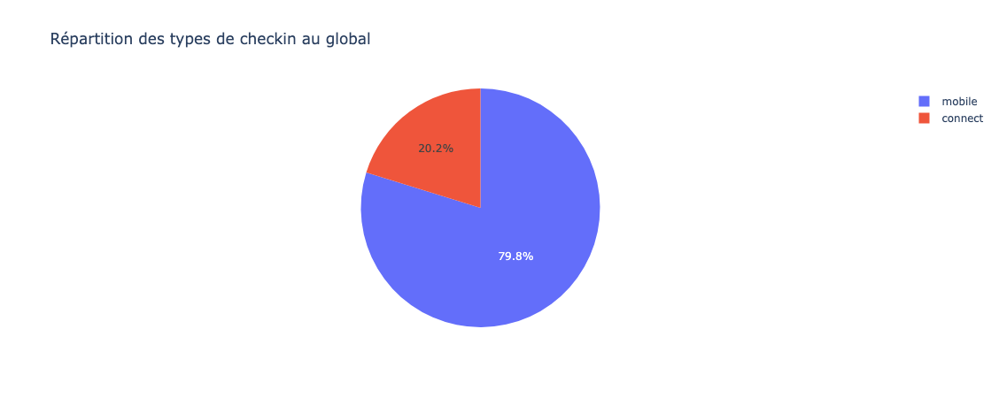
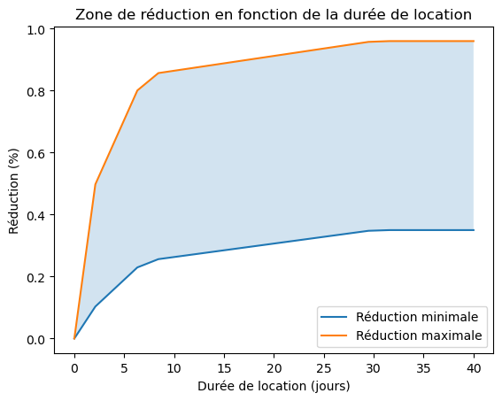
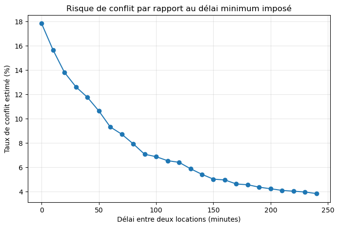
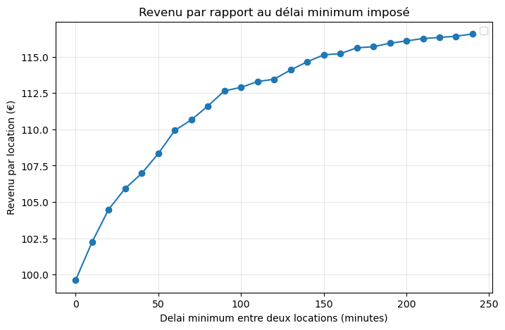
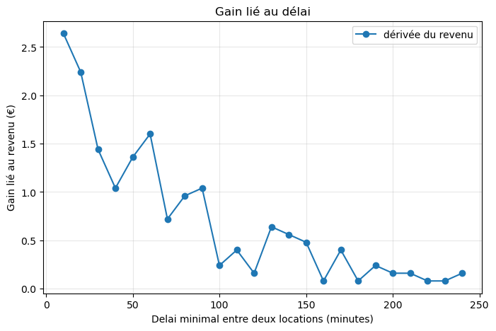
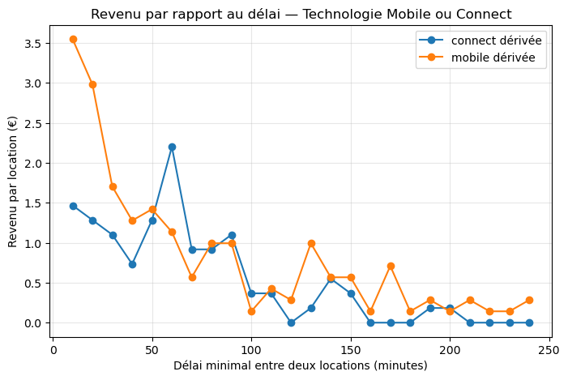

# getaround

**Bloc 5 - Industrialisation d'un algorithme d'apprentissage automatique et automatisation des processus de décision.**

Ce projet est à réaliser pour valider partiellement la certification Data Science - Fullstack : Certification RNCP35288 CDSD avec le bloc 5.

- Standardiser la construction et l'environnement informatique d'un algorithme d'apprentissage automatique grâce des outils de production comme MLflow et Docker afin de faciliter la mise en production de projets d'intelligence artificielle sur tous types de plateformes
- Créer une interface de programmation applicative grâce à des outil comme AWS sagemaker afin de donner un accès à échelle aux prédictions des algorithmes d'apprentissage automatique à l'ensemble des équipes métiers concernées
- Déployer une application web intégrant des algorithmes de statistiques prédictives (Machine Learning et Deep Learning) grâce à des outils comme Flask, Heroku ou AWS sagemaker pour les rendre utilisables par l'ensemble des équipes métiers afin d'automatiser leurs processus de décision.

Ce projet est également déposé sur github :  [https://github.com/pradelf/getaround](https://github.com/pradelf/getaround)
___


___


- [getaround](#getaround)
  - [Description et contexte du projet](#description-et-contexte-du-projet)
    - [Contexte](#contexte)
    - [Projet 🚧](#projet-🚧)
    - [Objectifs 🎯](#objectifs-🎯)
      - [Tableau de bord web](#tableau-de-bord-web)
      - [Machine Learning – endpoint `/predict`](#machine-learning-–-endpoint-predict)
      - [Page de documentation](#page-de-documentation)
      - [Mise en production en ligne](#mise-en-production-en-ligne)
    - [Aides 🦮](#aides-🦮)
      - [Partage du code](#partage-du-code)
    - [Livrables 📬](#livrables-📬)
    - [Données](#données)
  - [Organisation du projet](#organisation-du-projet)
    - [Structure du projet](#structure-du-projet)
    - [Données](#données-1)
    - [Point d'entrée](#point-dentrée)

___
Projet d'évaluation des impacts de retard sur les locations de getaround.

## Description et contexte du projet

[GetAround](https://www.getaround.com/?wpsrc=Google+Organic+Search) est l’équivalent d’Airbnb pour les voitures. Il est possible de louer des véhicules appartenant à des particuliers pour quelques heures ou plusieurs jours. Fondée en 2009, cette entreprise a connu une croissance rapide. En 2019, elle comptait plus de 5 millions d’utilisateurs et environ 20 000 véhicules disponibles dans le monde.

En tant que partenaire de Jedha, GetAround a proposé le challenge suivant :

### Contexte

Lors de la location d’un véhicule, les utilisateurs doivent réaliser :

- un **check-in** au début de la location,
- un **check-out** à la fin de la location,

afin de :

- évaluer l’état du véhicule et signaler aux autres parties les dommages préexistants ou survenus pendant la location ;
- comparer les niveaux de carburant ;
- mesurer le nombre de kilomètres parcourus.

Le check-in et le check-out peuvent être réalisés selon trois modalités distinctes :

- **📱 Mobile** : contrat de location signé via l’application mobile, le conducteur et le propriétaire se rencontrent et signent tous deux sur le smartphone du propriétaire ;
- **Connect** : le conducteur ne rencontre pas le propriétaire et ouvre le véhicule à l’aide de son smartphone ;
- **📝 Papier** : contrat papier (cas négligeable).

Pour comprendre le business model de Get Around, un résumé de leur mode de fonctionnement est donner sur la page [ci-dessous.](./docs/Analysis-GetAround_Business_model.md)

### Projet 🚧

Pour cette étude de cas, nous vous proposons de vous placer dans notre situation et de reproduire une analyse que nous avons menée en 2017 🔮🪄

Sur GetAround, les conducteurs réservent des véhicules pour une période donnée, allant d’une heure à plusieurs jours. Ils sont censés restituer le véhicule à l’heure prévue, mais il arrive que certains conducteurs soient en retard lors du check-out.

Ces retards peuvent générer une forte friction pour le conducteur suivant lorsque le véhicule est reloué le même jour. Le service client rapporte fréquemment des utilisateurs mécontents ayant dû attendre le retour du véhicule depuis la location précédente, voire contraints d’annuler leur réservation parce que le véhicule n’avait pas été restitué à temps.

### Objectifs 🎯

Afin de limiter ces problèmes, nous avons décidé d’implémenter un **délai minimum entre deux locations**. Un véhicule ne sera pas affiché dans les résultats de recherche si les heures de check-in ou de check-out demandées sont trop proches d’une location déjà existante.

Cette solution permet de réduire les problèmes de retard au check-out, mais elle peut également impacter négativement les revenus de GetAround et des propriétaires : il est donc nécessaire de trouver le bon compromis.

**Notre Product Manager doit encore trancher sur les points suivants :**

- **seuil** : quelle doit être la durée minimale du délai entre deux locations ?
- **périmètre** : faut-il activer cette fonctionnalité pour tous les véhicules ou uniquement pour les véhicules Connect ?

Afin de l’aider à prendre la bonne décision, il vous est demandé de produire des analyses de données pertinentes. Voici quelques premières pistes de réflexion pour lancer la discussion (n’hésitez pas à approfondir avec des analyses supplémentaires) :

- Quelle part des revenus des propriétaires serait potentiellement affectée par cette fonctionnalité ?
- Combien de locations seraient impactées en fonction du seuil et du périmètre choisis ?
- À quelle fréquence les conducteurs sont-ils en retard pour le check-in suivant ? Quel est l’impact pour le conducteur suivant ?
- Combien de situations problématiques seraient résolues selon le seuil et le périmètre retenus ?

#### Tableau de bord web

Commencez par construire un **dashboard** destiné à aider l’équipe Produit à répondre aux questions ci-dessus. Vous pouvez utiliser `streamlit` ou toute autre technologie que vous jugerez appropriée.

#### Machine Learning – endpoint `/predict`

En complément des analyses précédentes, l’équipe Data Science travaille sur un sujet d’**optimisation de la tarification**. Des données ont été collectées afin de proposer des prix optimaux aux propriétaires à l’aide de modèles de Machine Learning.

Vous devez fournir au minimum **un endpoint** `/predict`. L’URL complète est : `https://pradelf-getaround-api.hf.space/predict`.

Cet endpoint doit accepter des requêtes **POST** avec des données d’entrée au format JSON et retourner les prédictions correspondantes. On suppose que **les données d’entrée sont toujours correctement formatées** ; la gestion des erreurs est donc optionnelle.

Exemple d’entrée :

```
{
  "model_key": "Peugeot",
  "mileage": 10000,
  "engine_power": 130,
  "fuel": "petrol",
  "paint_color": "black",
  "car_type": "convertible",
  "private_parking_available": true,
  "has_gps": true,
  "has_air_conditioning": true,
  "automatic_car": true,
  "has_getaround_connect": true,
  "has_speed_regulator": true,
  "winter_tires": true
}
```

La réponse attendue est un JSON contenant une clé `prediction` correspondant aux valeurs prédites.

Exemple de réponse :

```
{
  "prediction": 145.66041029414708,
  "detail": "Prédiction du tarif journalier (nul si aucun modèle)."
}
```

#### Page de documentation

Vous devez fournir aux utilisateurs une **documentation** décrivant votre API.

Cette documentation est accessible à l’URL `/docs` de mon site sur hugging face <https://pradelf-getaround-api.hf.space/docs>.

Cette documentation contient :

- un titre de niveau h1 (le titre est libre) ;
- une description de chaque endpoint disponible, précisant le nom de l’endpoint, la méthode HTTP, les entrées requises et les sorties attendues (des exemples peuvent être fournis).

#### Mise en production en ligne

Le déploiement est **hébergé avec son API en ligne** chez [Hugging Face](https://huggingface.co/spaces),

#### Partage du code

Pour permettre l’évaluation, le code est versionné dans un dépôt [GitHub](https://github.com/pradelf/getaround)avec ce fichier `README.md` décrivant brièvement le projet, la procédure d’installation locale et l’URL de la version en ligne.

### Livrables 📬

Pour valider ce projet, vous devrez fournir :

- un **dashboard** déployé en production (accessible via une page web) ;
- l’**ensemble du code source** dans un **dépôt GitHub**, dont vous fournirez l’URL ;
- une **API documentée et accessible en ligne** (Hugging Face ou autre) contenant au moins **un endpoint `/predict`** conforme aux spécifications ci-dessus. Il doit être possible d’interroger l’endpoint `/predict` via `curl` :

```shell
curl -X 'POST' \
  "https://pradelf-getaround-api.hf.space/predict" \
  -H 'accept: application/json' \
  -H 'Content-Type: application/json' \
  -d '{
  "model_key": "Peugeot",
  "mileage": 10000,
  "engine_power": 130,
  "fuel": "petrol",
  "paint_color": "black",
  "car_type": "convertible",
  "private_parking_available": true,
  "has_gps": true,
  "has_air_conditioning": true,
  "automatic_car": true,
  "has_getaround_connect": true,
  "has_speed_regulator": true,
  "winter_tires": true
}'
```

Ou en Python :

```python
import requests

response = requests.post( "https://pradelf-getaround-api.hf.space/predict",
  {
  "model_key": "Peugeot",
  "mileage": 10000,
  "engine_power": 130,
  "fuel": "petrol",
  "paint_color": "black",
  "car_type": "convertible",
  "private_parking_available": true,
  "has_gps": true,
  "has_air_conditioning": true,
  "automatic_car": true,
  "has_getaround_connect": true,
  "has_speed_regulator": true,
  "winter_tires": true
})
print(response.json())
```

### Données

Pour les données, deux fichiers de données sont nécessaires et son placer dans le repertoire /data/raw:

- [Delay Analysis](https://full-stack-assets.s3.eu-west-3.amazonaws.com/Deployment/get_around_delay_analysis.xlsx) 👈 Analyse de données
- [Pricing Optimization](https://full-stack-assets.s3.eu-west-3.amazonaws.com/Deployment/get_around_pricing_project.csv) 👈 Machine Learning

___

## Organisation du projet

### Structure du projet

Le projet est inclus dans ce dépôt et il a la structure de fichier suivante :

``` bash
├── LICENSE            <- Licence open source ici MIT
├── Makefile           <- Makefile avec des commandes pratiques comme 'make data' ou 'make train'
├── README.md          <- README principal du projet à destination des développeurs
├── data
│   ├── external       <- Données provenant de sources tierces
│   ├── interim        <- Données intermédiaires ayant déjà subi des transformations
│   ├── processed      <- Jeux de données finaux et canoniques utilisés pour la modélisation
│   └── raw            <- Données brutes d’origine, immuables
│
├── docs               <- Projet mkdocs par défaut ; voir www.mkdocs.org pour plus de détails
│
├── models             <- Modèles entraînés et sérialisés, prédictions des modèles ou résumés
│
├── notebooks          <- Notebooks Jupyter. Convention de nommage : un numéro (pour l’ordre),
│                         les initiales de l’auteur, et une courte description séparée par des -,
│                         par exemple : '10-jqp-exploration-initiale-des-donnees'
│
├── pyproject.toml     <- Fichier de configuration du projet avec les métadonnées du package
│                         getaround et la configuration d’outils comme black
│
├── references         <- Dictionnaires de données, manuels et autres documents explicatifs
│
├── reports            <- Analyses générées (HTML, PDF, LaTeX, etc.)
│   └── figures        <- Graphiques et figures générés pour les rapports
│
├── requirements.txt   <- Fichier des dépendances pour reproduire l’environnement d’analyse,
│                         par exemple généré avec pip freeze > requirements.txt
│
├── setup.cfg          <- Fichier de configuration pour flake8
│
└── getaround          <- Code source utilisé dans ce projet pour la web app, l'api web et MLFlow sur Hugging Faces.

```

Dans ce projet, les plateformes Github ainsi que. Hugging Face sont utilisées.
Normalement, le mieux pour éviter la redondance de données serait d'archiver et versionner le code sur GitHub en ajoutant des submodules ou subtree pour relier le dépôt Git sur GitHub au 3 dépôts sur Hugging Face. Nous avons pris le partie de construire un space par application déployée sur Hugging Face. Ces spaces sont regrouppés au sein d'une [collection](https://huggingface.co/collections/pradelf/getaround) contenant les spaces :

- [Web APP tableau de bord](https://huggingface.co/spaces/pradelf/getaround-web)
-[Web serveur pour fournir les web fonctions et leur documentation](https://huggingface.co/spaces/pradelf/getaround-api)
- et enfin [le déploiement de MLFlow pour tracer, archiver et versionner notre modèle d'IA sur les prixe de location.](https://huggingface.co/spaces/pradelf/getaround-mlflow)
à laquelle nous avons ajouté le [dataset](https://huggingface.co/datasets/pradelf/getaround-dataset) de ce projet GetAround.

--------

### Données

Les données du projet sont rangées dans le repertoire data/raw :

- [data/raw/get_around_delay_analysis.xlsx](./data/raw/get_around_delay_analysis.xlsx) : Données pour l'analyse des retards au format excel
- [data/raw/get_around_delay_analysis.csv](./data/raw/get_around_delay_analysis.csv) : Données pour l'analyse des retards au format csv
- [data/raw/get_around_pricing_project.csv](./data/raw/get_around_pricing_project.csv) : Données pour les price de location des véhicules.

Comme les données sont de faible volume, je les ai placé dans le repertoire `data/raw` du projet. Mais pour l'exercice, elles sont également rangées comme un dataset de Hugging Face dans un dépôt [Git Xet](https://huggingface.co/docs/hub/xet/index) : [getaround-dataset](https://huggingface.co/datasets/pradelf/getaround-dataset) qui permet de gérer par un autre moyen que `git lfs` des fichiers binaires ou volumineux.

Concernant les données, il est notable que les deux datasets n'autorise aucune jointure directe. En effet, l'identifiant d'un véhicule dans le dataset de prix n'est pas relié à l'identifiant du véhicule dans le dataste d'analyse de retard. Ce point est très dommageable pour répondre à l'opportunité d'imposer ou non une durée incompressible entre la fin de location d'un véhicule et le début der sa location suivante. Plutôt que d'avoir des données directes et plutôt fiable, il va être necessaire d'effectuer des hypothèses plus ou moins forte pour établir le coût économique des retards de restitution de véhicule.

L'hypothèse prise ici va se baser sur un prix moyen journalier de la location d'un véhicule. C'est une hypothèse simple et nous pourrions enrichir cette hypothèse en essayant de créer une correspondance entre les distributions statistiques de véhicule et celle des véhicules impliqués dans la location. Cette dernière action ne sera pas utilisé dans le présent projet pour des raisons de moyen impliqué dans ce projet.

### Points d'entrée

Dans cette section, vous trouvez les différents points d'entrée pour aborder le projet.

#### Etude et analyse du projet

Le point d'entrée pour l'analyse du projet est le notebook : [01-Getaround_analysis_FR.ipynb](./notebooks/01-Getaround_analysis_FR.ipynb).
Le point d'entrée pour l'EDA du projet est le notebook : [02_Getaround_eda.ipynb](./notebooks/02_Getaround_eda.ipynb).
Le point d'entrée pour l'entraînement des modèles est le script : [03_Getaround_model_training.ipynb](./getaround/notebooks/03_Getaround_model_training.ipynb).
Le point d'entrée pour la prédiction des prix de location est le projet Docker dans le repertoire : [getaround/api](./getaround/api).

#### Livrables du projet

Nous donnons ici les produits ou service livré pour le projet. Comme évoqué le source de ces solutions sont archivé dans le repertoire [getaround/api](./getaround/api) pour l'api et [getaround/web](./getaround/web).
Chacun de ces repertoires est déployé pour un projet (ou space) Hugging Face.

La documentation de l'API est en ligne sur hugging face sous l'url : [https://pradelf-getaround-api.hf.space/docs](https://pradelf-getaround-api.hf.space/docs)
Le point d'entrée pour l'Application web de calcul de prix est : [https://pradelf-getaround-web.hf.space](https://pradelf-getaround-web.hf.space)

## Conclusion par rapport à l'objectif

Il nous est demandé de conseiller le manager sur l'opportunité de mettre en place un délai minimal entre deux locations qui limite les annulations tout en maximisant les revenus.

Nous commençons par répondre à la question la plus concernant le périmètre.

### faut-il activer cette fonctionnalité pour tous les véhicules ou uniquement pour les véhicules Connect ?

Il est important de constater qu'il y a plus de véhicule avec la technologie mobile que connect (ajout d'un boitier dans le véhicule pour une location autonome).


Les chiffres font apparaître clairement une différence entre les technologies Connect et Mobile utilisées dans les véhicules en favorisant l'usage de la technologie connect.

En effet, l'EDA faite sur Les retards sont très différents selon la technologie.

| technologie | retard médian |
|---|---|
| Connect | -9 min |
| Mobile | +14 min |

| type | retard pour 75% des retards |
|---|---|
|Connect | 94 min|
| Mobile | 142 min |

Nous en déduisons que les véhicules équipés des boitiers "Connect" ont beaucoup moins de retard.

Il serait donc interessant de mettre en place des délais minimaux en onction de la technologie équipant le véhicule.

Nous passons maintenant à la question la plus impactante concernant le seuil de délai entre deux locations.

### quelle doit être la durée minimale du délai entre deux locations ?

Grâce aux données, il apparaît que sur les  21310 locations données dans le dataset de retard, on a :

- 15,3 % des locations qui finissent annulées

- 84,7 % qui finissent normalement voir même avec un rendu prématuré du véhicule.

Le problème principal vient du retard de restitution de la location précédente.
Quand le retard dépasse le temps disponible avant la location suivante :
$$delay > gap\ between\ rentals$$
➡ le locataire suivant ne peut pas récupérer la voiture
➡ cela entraîne souvent annulation ou mauvaise expérience.
Il est à noter qu'en étudiant le business model de Get Around (voir la page [Business Model](./docs/Analysis-GetAround_Business_model.md) faite à partir de la lecture du site de [Get Around](https://getaround.com))
, le prix de la location journalière est différent suivant la durée de la location. Cette différence dépend du choix du propriétaire et donne une variabilité du prix conséquente comme on peut le voir sur le graphique ci-dessus.
De plus la marque du véhicule comme son emplacement (non présent dans les données) peut influer le prix de location. A titre d'exemple, je donne le prix moyen de location journalière en € en fonction de la marque.

|marque | Location journalière moyenne |
|---| ---|
| Citroën |  108.76 |
| Peugeot |  104.92 |
| PGO |  126.09 |
| Renault |  120.61 |
| Audi |  130.54 |
| BMW |  117.43 |
| Ford |  111.00 |
| Mercedes |  121.36 |
| Opel |  155.58 |
| Porsche |  144.67 |
| Volkswagen |  134.12 |
| KIA Motors |  159.00 |
| Alfa Romeo |  157.67 |
| Ferrari |  150.52 |
| Fiat |  93.00 |
| Lamborghini |  157.50 |
| Maserati |  188.67 |
| Lexus |  193.00 |
| Honda |  145.00 |
| Mazda |  67.00 |
| Mini |  204.00 |
| Mitsubishi |  170.68 |
| Nissan |  111.13 |
| SEAT |  181.24 |
| Subaru |  182.34 |
| Suzuki |  223.88 |
| Toyota |  149.79 |
| Yamaha |  133.00 |

Le prix moyen de location est quant à lui de : 121,21 €.
Aussi nous restons sur l'usage du prix moyen de location journalière , 121,21 €, pour estimer les pertes économiques lièes à l'insertion d'un délai entre location.

Sur cette base, l'analyse est faite dans le notebook [analyse des gains de revenu](./notebooks/02_Getaround_eda.ipynb#résultat)

E résumé, on modélise le **conflit probable** par :

conflit si : $$ delay > gap + D$$

où :

- `delay_at_checkout_in_minutes` = retard de restitution
- `time_delta_with_previous_rental_in_min` = temps disponible entre deux locations
- `D` = délai imposé entre location par la plateforme qui est le sujet de l'étude.

Ainsi la revenu probable $R$ est relié à la probabilité de conflit $P_{conflit}$ entre deux locations:

$ R(D) = P_{moyen} \times (1 - P_{conflit}(D)) $

avec :

$ P_{moyen} = prix journalier moyen ici de 121,21 €.

$ P_{conflit}(D) $= probabilité qu'un retard dépasse le temps disponible plus le buffer (D).

Il s'agit de l'hypothèse nécessaire pour estimer les données économiques pour la prise de décision.





Le point de bascule qui correspond au p^lateau de la dérivée des revenus se situe typiquement autour de **120 à 150 minutes** comme on peut le voir sur le graphique ci-dessous.


Cependant, le choix final appartient au manager.
En différenciant entre les technologies, on retrouve un point de bascule vers un plateau de gain pour des délais similaires minimaux entre 100 minute et 120 minutes.


La préconisation qui semble avoir le meilleur compromis global est donc de mettre un délai minimale entre deux locations successives de 120 minutes.

### autres informations intéressantes

Au passage des réponses aux questions suivantes sont apportés :

- Quelle part des revenus des propriétaires serait potentiellement affectée par cette fonctionnalité ?

- Combien de locations seraient impactées en fonction du seuil et du périmètre choisis ?

- À quelle fréquence les conducteurs sont-ils en retard pour le check-in suivant ?

- Quel est l’impact pour le conducteur suivant ?

- Combien de situations problématiques seraient résolues selon le seuil et le périmètre retenus ?
